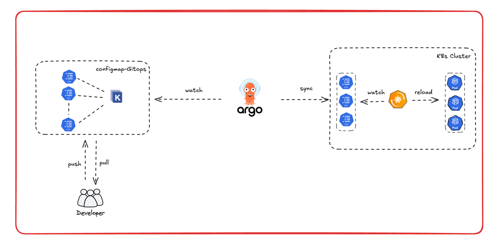

# ConfigMap 변경을 자동 반영하는 GitOps 구성하기 

### 기존 ConfigMap 관리 방식의 한계
ConfigMap 변경을 자동으로 반영하는 GitOps 구성을 하기 전까지, 우리 팀은 다음과 같은 방식으로 작업을 진행하고 있었습니다.

개발자들이 ConfigMap에 추가하거나 수정해야 할 값이 생기면, 제가 ArgoCD와 연결된 Git 저장소 내 ConfigMap 정의 파일을 직접 수정하고, 커밋한 뒤, 관련 파드를 수동으로 재시작(rollout restart)해주는 방식이었죠.

이 작업은 표면적으로는 단순해 보이지만, 운영팀 전체 리소스의 반복적인 소모를 유발하고 있었고, 개발자 입장에서도 빈번한 요청을 전달하는 데 부담이 따를 수밖에 없었습니다.
이러한 불편함을 줄이고, 더 나아가 자율적인 설정 관리가 가능하게 만들 수 없을까 고민하게 되었습니다.

### 접근 방식과 해결방법
그래서 저는 다음과 같은 질문을 중심으로 접근을 시작했습니다:
1. 우리가 이미 보유한 기술 스택으로 해결할 수 있는 문제인가?
2. 개발자들이 직접 ConfigMap을 컨트롤할 수 있는 방식은 무엇인가?
3. ConfigMap이 수정되었을 때, 자동으로 관련 파드를 재시작할 수 있는 툴이나 프로젝트가 존재하는가?

여러 대안을 비교해본 결과, 우리 팀의 GitOps 구조에 가장 잘 맞는 해법은 Reloader + Argo CD 조합이었습니다.
주요 이유는 별도의 커스텀 로직 없이도 단순하게 적용 가능하고, DevOps팀이 직접 개입하지 않아도 개발자들이 설정을 변경했을 때 곧바로 반영된다는 점이었습니다.

### 구조 설계 및 도입 배경
Reloader를 간단히 설명드리자면, Reloader는 Kubernetes에서 ConfigMap이나 Secret 리소스에 변경이 감지되면, 해당 리소스를 참조하고 있는 Deployment나 StatefulSet을 자동으로 재시작해주는 컨트롤러입니다.

저희 팀은 이미 Kustomize + Argo CD 조합으로 GitOps 기반의 배포 환경을 운영하고 있었고, 애플리케이션 리소스들과 함께 ConfigMap도 하나의 배포 단위로 포함되어 있었습니다.

하지만 이 구조에서는 ConfigMap만 수정하려 해도 전체 애플리케이션 리소스를 함께 변경해야 했기 때문에, 설정 관리의 유연성이 떨어지고 커밋 단위도 무거워지는 문제가 있었습니다.

그래서 저는 먼저 ConfigMap을 분리했고, ConfigMap만 별도로 관리할 수 있도록 GitOps 구조로 변경했습니다.

변경 후 개발자분들은 직접 ConfigMap을 수정하면, Argo CD를 통해 해당 변경이 자동으로 동기화되고, Reloader가 이를 감지하여 관련 Deployment가 자동으로 재시작되는 것을 확인할 수 있었습니다.

### 아키텍처 설명

글로만 보면 다소 이해가 어려울 수 있기 때문에, 그림을 보면서 다시 설명드리겠습니다.
저희는 먼저 ConfigMap을 별도의 Git 저장소로 분리했고, Argo CD가 해당 저장소를 바라보도록 설정했습니다.
그리고 Reloader가 클러스터 내 ConfigMap 리소스를 watch하도록 구성했으며,
이후에는 ConfigMap 값에 변경이 생기면, 이를 참조하고 있는 리소스를 자동으로 rollout restart하도록 설정했습니다.

### 결론
이번 구조 개선을 통해 ConfigMap 변경 작업이 더 이상 번거로운 수작업이 아닌,
Git 기반의 자동화된 흐름으로 자연스럽게 흘러가게 되었습니다. 작은 구조의 변화였지만, 개발자와 운영자 모두의 부담을 크게 줄여주는 개선이었고,
GitOps의 진짜 장점이 무엇인지 팀원들과 함께 체감할 수 있는 계기가 되었습니다. 앞으로도 이런 작지만 실용적인 개선을 꾸준히 이어가 보려고 합니다.