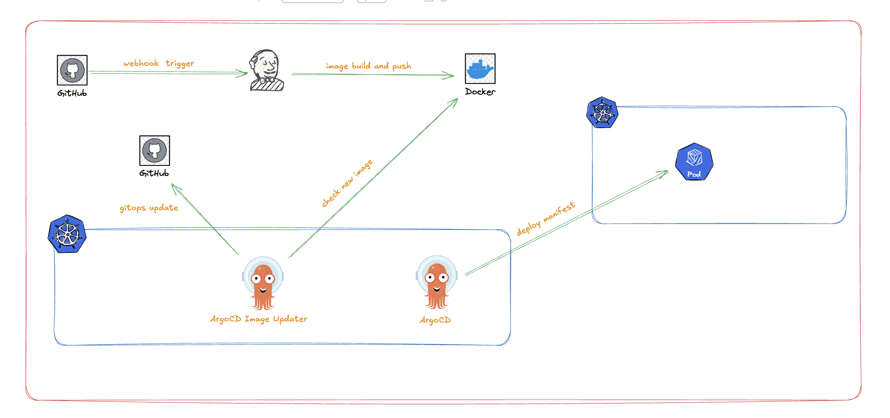

# ArgoCD Image Updater




## 개요
1. 도구 소개 (Overview)
Argo CD Image Updater는 Argo CD로 관리되는 Kubernetes 워크로드의 컨테이너 이미지를 자동으로 최신 버전으로 업데이트해 주는 도구입니다.

ArgoCD Image Updater 역할
Argo CD가 관리하는 애플리케이션(Application)을 모니터링하다가, 연결된 컨테이너 레지스트리(Docker Hub, ECR, GCR 등)에 새로운 버전의 이미지가 감지되면 자동으로 Argo CD 애플리케이션 설정을 업데이트합니다.


## ArgoCD Image Updater 동작 방식
argocd app set --helm-set image.tag=v1.0.1 명령어를 자동으로 실행하는 것과 유사한 원리입니다.

자동화: 레지스트리를 주기적으로 스캔하고, 조건(버전 제약 등)에 맞는 새 이미지가 있으면 업데이트를 트리거합니다.

GitOps: 단순히 클러스터 상태만 바꾸는 것이 아니라, 변경 사항을 Git 저장소에 다시 커밋(Write-back)하여 GitOps 원칙을 유지할 수 있습니다.


## Image Updater 주요기능 (Features)
공식 문서에 명시된 주요 기능은 다음과 같습니다.

1. 다양한 업데이트 전략 (Update Strategies): SemVer (semver): 시맨틱 버저닝(예: 1.0.x) 규칙에 따라 허용된 가장 높은 버전으로 업데이트합니다.

2. Newest Build (newest-build / latest): 생성일 기준으로 가장 최근에 만들어진 이미지 태그로 업데이트합니다.

3. Alphabetical (alphabetical / name): 알파벳 순서상 가장 마지막 태그로 업데이트합니다.

4. Digest (digest): latest와 같이 태그 이름은 같지만 내용이 변하는(mutable) 태그의 경우, SHA 다이제스트를 확인하여 업데이트합니다.

5. 광범위한 레지스트리 지원: 주요 퍼블릭/프라이빗 컨테이너 레지스트리를 지원하며, pull secrets 설정도 유연합니다.

6. Git Write-back (Git 쓰기 기능): 이미지 변경 사항을 Git 저장소에 직접 커밋하고 푸시할 수 있습니다 (가장 강력한 기능).

7. 필터링: 정규식(Regex) 등을 사용하여 업데이트할 태그 리스트를 필터링할 수 있습니다.

8. 병렬 처리: 여러 애플리케이션의 업데이트를 병렬로 처리할 수 있습니다.

9. 웹훅(Webhook) 지원: 레지스트리(Docker Hub, Quay, Harbor 등)로부터 이벤트를 수신해 즉시 업데이트를 트리거할 수 있습니다.


## 아키텍처 및 구성 방식의 변화 (Annotation vs CRD)
중요: v1.0.0 릴리스부터 구성 방식이 기존의 Annotation(주석) 기반에서 CRD(Custom Resource Definition) 기반으로 대거 전환되었습니다.

기존에는 Argo CD Application 리소스에 주석을 달아 설정했지만, 이제는 ImageUpdater라는 별도의 커스텀 리소스를 통해 어떤 이미지를 모니터링하고 업데이트할지 정의합니다. 이는 설정 관리를 더 체계적이고 명시적으로 만들어줍니다.

## CI/CD 파이프라인에서의 위치 (The Missing Link)
보통의 GitOps 파이프라인은 다음과 같은 끊김(Gap)이 있습니다.

CI: 코드 빌드 -> 이미지 생성 -> 레지스트리 푸시 

Gap: 누군가 Git 저장소의 매니페스트(YAML) 파일에 이미지 태그를 수정해줘야 합니다.

CD (Argo CD): Git 변경 감지 -> 클러스터 배포

Argo CD Image Updater는 이 'Gap'을 자동화합니다. CI 파이프라인이 굳이 Git 저장소에 접근해서 커밋할 필요 없이, 레지스트리에 이미지만 푸시하면 Image Updater가 이를 감지하여 배포(또는 Git 커밋)를 수행합니다.

C. 업데이트 방식 비교 (Local vs Git)
가장 중요한 설정 포인트입니다.

Argo CD API 방식 (Local): Argo CD의 파라미터 오버라이드 기능을 사용해 즉시 반영합니다.
- 장점: 빠르고 설정이 간단합니다.
- 단점: Git 저장소의 매니페스트 파일은 옛날 버전 태그를 가리키고 있어, "Git이 진실의 원천(Source of Truth)"이라는 원칙이 약해질 수 있습니다.

Git Write-Back 방식: Image Updater가 Git 저장소를 클론하여 태그를 수정한 뒤 커밋&푸시합니다.
- 장점: GitOps 원칙을 완벽하게 준수합니다. 모든 변경 이력이 Git에 남습니다.
- 단점: 설정이 조금 더 복잡(Git 인증 필요)하며, 커밋 로그가 많아질 수 있습니다.

## 제약 사항 (Limitations)
관리 범위: 반드시 Argo CD로 관리되는 애플리케이션이어야 합니다.

도구 제한: Helm이나 Kustomize로 렌더링되는 매니페스트만 지원합니다. (일반 Plain YAML 파일은 이미지 태그를 파라미터화하기 어렵기 때문)

Helm의 경우: 템플릿이 image.tag와 같이 파라미터를 통해 이미지를 변경할 수 있도록 작성되어 있어야 합니다.


---
## ArgoCD Image Updater CRD 설치하기

위에서 언급했던것처럼 ArgoCD Image Updater는 v1.0.0 릴리스부터 구성 방식이 기존의 Annotation(주석) 기반에서 CRD(Custom Resource Definition) 기반으로 대거 전환되었습니다.


### ArgoCD Imager Updater 설치 

```markdown

helm repo add argo https://argoproj.github.io/argo-helm

helm repo update

helm upgrade --install argocd-image-updater argo/argocd-image-updater -n argocd

```


### 배포되어있는 values.yaml 가져오기
```markdown

helm get values argocd-image-updater -n argocd --all > image-updater-values.yaml

```

````markdown
```yaml
COMPUTED VALUES:
affinity: {}
authScripts:
  enabled: false
  name: argocd-image-updater-authscripts
  scripts: {}
config:
  git.commit-message-template: ""
  git.commit-sign-off: false
  git.commit-signing-key: ""
  git.commit-signing-method: ""
  git.email: ""
  git.user: ""
  kube.events: false
  log.level: info
  name: argocd-image-updater-config
  # 이미지 저장소에 맞게 인증 정보 넣어주기
  registries:
    - name: nexus
      prefix: example.nexus.com:55000
      api_url: http://example.nexus.com:55000
      credentials: pullsecret:argocd/nexus-regcred # argocd imager updater가 이미지저장소에 접근할 수 있게 secret으로 배포 
  sshConfig:
    config: ""
    name: argocd-image-updater-ssh-config
containerPorts:
  health: 8081
  metrics: 8443
  webhook: 8082
crds:
  additionalLabels: {}
  annotations: {}
  install: true
  keep: true
createClusterRoles: true
dualStack:
  ipFamilies: []
  ipFamilyPolicy: ""
extraArgs: []
extraEnv: []
extraEnvFrom: []
extraObjects: []
fullnameOverride: ""
image:
  pullPolicy: Always
  repository: quay.io/argoprojlabs/argocd-image-updater
  tag: ""
imagePullSecrets: []
ingress:
  annotations: {}
  enabled: false
  extraHosts: []
  extraPaths: []
  hostname: ""
  ingressClassName: ""
  labels: {}
  path: /webhook
  pathType: Prefix
  tls: []
initContainers: []
metrics:
  enabled: false
  service:
    annotations: {}
    labels: {}
    servicePort: 8443
  serviceMonitor:
    additionalLabels: {}
    enabled: false
    interval: 30s
    metricRelabelings: []
    namespace: ""
    relabelings: []
    selector: {}
nameOverride: ""
namespaceOverride: ""
nodeSelector: {}
podAnnotations: {}
podLabels: {}
podSecurityContext:
  runAsNonRoot: true
priorityClassName: ""
rbac:
  enabled: true
replicaCount: 1
resources: {}
securityContext:
  allowPrivilegeEscalation: false
  capabilities:
    drop:
    - ALL
  readOnlyRootFilesystem: true
  runAsNonRoot: true
  seccompProfile:
    type: RuntimeDefault
service:
  annotations: {}
  externalIPs: []
  externalTrafficPolicy: Cluster
  labels: {}
  loadBalancerClass: ""
  loadBalancerIP: ""
  loadBalancerSourceRanges: []
  nodePortHttp: 30080
  nodePortHttps: 30443
  port: 8080
  servicePortHttpName: server-port
  sessionAffinity: None
  type: ClusterIP
serviceAccount:
  annotations: {}
  create: true
  labels: {}
  name: ""
tolerations: []
updateStrategy:
  type: Recreate
volumeMounts: []
volumes: []`

`# helm upgrade 

helm upgrade argocd-image-updater argo/argocd-image-updater \
  -n argocd \
  -f image-updater-values.yaml # 위 yaml`
```
````

### 위 설정을 가지고 helm upgrade 
```markdown
helm upgrade argocd-image-updater argo/argocd-image-updater \
  -n argocd \
  -f image-updater-values.yaml
```


## GitOps 환경에서 Git Write-Back(Git에 쓰기) 방식을 통해 이미지 태그를 업데이트하는 구성

````markdown
```yaml
apiVersion: argocd-image-updater.argoproj.io/v1alpha1
kind: ImageUpdater
metadata:
  name: example-app
  namespace: argocd
spec:
  # Argo CD Application 리소스가 존재하는 네임스페이스
  namespace: argocd

  applicationRefs:
    - namePattern: "example-app"
      images:
        - alias: "auth"
          imageName: "nexus.example.com:55000/dev/exampleapp"
          commonUpdateSettings:
            # 태그 필터링: bf-dev-로 시작하는 태그만 허용
            allowTags: "regexp:^dev-.*"
            # 업데이트 전략: 알파벳 순서상 마지막 태그 (문자열 기준 최신)
            updateStrategy: "alphabetical"
          manifestTargets:
            kustomize:
              # kustomization.yaml 파일 내의 images[].name과 일치해야 함
              name: "example-app"

  writeBackConfig:
    method: "git"
    gitConfig:
      repository: "http://gitlab.example.com/example/gitops.git"
      branch: "main"
      writeBackTarget: "kustomization:."
```
````
metadata.name: 이 ImageUpdater 리소스 자체의 이름입니다. 관리하기 쉬운 이름을 지정합니다.

metadata.namespace: ImageUpdater 리소스가 생성될 네임스페이스입니다. 보통 Argo CD가 설치된 곳(argocd)에 둡니다.

spec.namespace: 중요합니다. ImageUpdater가 모니터링할 Argo CD Application들이 존재하는 네임스페이스를 지정합니다.

공식 문서 설명: Image Updater는 여기서 지정된 네임스페이스에 있는 Application 리소스만 스캔합니다.

namePattern: 업데이트 대상이 될 Argo CD Application의 이름입니다.

정확한 이름(example-app)을 쓰거나, 정규식(예: example-app-.*)을 사용할 수 있습니다.

alias: (선택 사항) 로그나 설정 내에서 이 이미지를 지칭할 별칭입니다. 설정이 복잡해질 때 유용합니다.

imageName: 모니터링할 컨테이너 레지스트리의 이미지 경로입니다. Image Updater는 이 주소를 주기적으로 조회(Pull X, 메타데이터 조회 O)하여 새로운 태그가 있는지 확인합니다.


allowTags (태그 필터링)

공식 문서: regexp: 접두사를 사용하면 정규표현식으로 태그를 필터링합니다.

설정 의미: ^dev-.*는 태그 이름이 반드시 dev-로 시작하는 것만 업데이트 대상으로 삼겠다는 뜻입니다.

예시: dev-1.0 (O), dev-20240101 (O), release-1.0 (X), latest (X)

이 옵션은 개발(dev), 스테이징(stg) 환경이 같은 레지스트리를 공유할 때, 다른 환경의 태그가 섞이지 않도록 방지하는 매우 중요한 설정입니다.

updateStrategy (업데이트 전략):

alphabetical: 태그 목록을 알파벳(문자열) 순서로 정렬했을 때 가장 마지막(Last)에 오는 태그를 선택합니다.

공식 문서: 기존의 name 전략이 alphabetical로 변경되었습니다.

주의점: 숫자 정렬이 아닌 문자열 정렬입니다. (예: v1.10이 v1.2보다 알파벳 순서상 앞설 수 있음). 하지만 보통 날짜(20240101)나 패딩된 숫자 포맷을 쓴다면 최신 버전을 잘 찾아냅니다.

비교: 이전 질문의 newest-build는 빌드 시간 기준이고, 이것은 태그 이름 기준입니다.


manifestTargets: 찾은 최신 이미지를 Git의 어떤 파일, 어떤 부분에 업데이트할지 지정합니다.

kustomize.name: Git 저장소에 있는 **kustomization.yaml 파일 내부의 images 리스트에 정의된 name**과 매칭됩니다.

작동 원리: 레지스트리 이미지 주소가 달라도, Kustomize의 newName이나 newTag를 교체하기 위해 사용하는 식별자(Key)입니다.

writeBackTarget: "kustomization:.":

kustomize: 업데이트 방식이 Kustomize임을 명시합니다.

. (점): 경로를 의미합니다.

핵심 해석: 앞서 설명해 드린 대로, **Argo CD Application(example-app)에 설정된 소스 경로(source.path)**를 기준으로 **현재 디렉토리(.)**에 있는 kustomization.yaml을 수정하라는 뜻입니다.

즉, ArgoCD Application source.path가 overlays/dev/라면, 최종 수정 파일은 repo/overlays/dev/kustomization.yaml이 됩니다.


## 마크다운 문법 가이드

### 1. 제목 (Headers)
```markdown
# 제목 1 (가장 큰 제목)
## 제목 2
### 제목 3
#### 제목 4
##### 제목 5
###### 제목 6 (가장 작은 제목)
```

### 2. 텍스트 스타일
```markdown
**굵은 글씨** 또는 __굵은 글씨__
*기울임체* 또는 _기울임체_
***굵은 기울임체*** 또는 ___굵은 기울임체___
~~취소선~~
`인라인 코드`
```

### 3. 목록 (Lists)

#### 순서 없는 목록 (Bullet Points)
```markdown
- 항목 1
- 항목 2
  - 하위 항목 2-1
  - 하위 항목 2-2
- 항목 3

또는

* 항목 1
* 항목 2
* 항목 3
```

#### 순서 있는 목록 (Numbered List)
```markdown
1. 첫 번째 항목
2. 두 번째 항목
3. 세 번째 항목
   1. 하위 항목 3-1
   2. 하위 항목 3-2
```

### 4. 코드 블록 (Code Blocks)

#### 인라인 코드
```markdown
`kubectl get pods` 명령어를 실행하세요.
```

#### 코드 블록 (언어 지정)
````markdown
```yaml
apiVersion: v1
kind: Pod
metadata:
  name: example-pod
```
````

#### 코드 블록 (언어 미지정)
````markdown
```
일반 텍스트 코드 블록
```
````

### 5. 링크 (Links)
```markdown
[링크 텍스트](https://example.com)
[상대 경로 링크](./other-file.md)
[이미지 링크](https://example.com/image.png)
```

### 6. 이미지 (Images)
```markdown


<!-- 크기 조절 (HTML 사용) -->

```

### 7. 표 (Tables)
```markdown
| 헤더 1 | 헤더 2 | 헤더 3 |
|--------|--------|--------|
| 셀 1   | 셀 2   | 셀 3   |
| 셀 4   | 셀 5   | 셀 6   |

<!-- 정렬 -->
| 왼쪽 정렬 | 가운데 정렬 | 오른쪽 정렬 |
|:---------|:----------:|------------:|
| 왼쪽     | 가운데     | 오른쪽      |
```

### 8. 인용구 (Blockquotes)
```markdown
> 이것은 인용구입니다.
> 여러 줄로 작성할 수 있습니다.

> 중첩 인용구
>> 중첩된 인용구
```

### 9. 수평선 (Horizontal Rules)
```markdown
---
또는
***
또는
___
```

### 10. 체크박스 (Checkboxes)
```markdown
- [ ] 완료되지 않은 작업
- [x] 완료된 작업
```

### 11. 이스케이프 문자
```markdown
\*별표 표시\*
\# 해시 표시
```

### 12. 줄바꿈
```markdown
문장 끝에 스페이스 2개를 추가하면  
다음 줄로 넘어갑니다.

빈 줄을 추가하면
새 단락이 시작됩니다.
```

## ArgoCD Image Updater 사용 예시

### 기본 설정

```yaml
apiVersion: argoproj.io/v1alpha1
kind: Application
metadata:
  name: my-app
  annotations:
    argocd-image-updater.argoproj.io/image-list: my-image=my-registry/my-image
    argocd-image-updater.argoproj.io/write-back-method: git
```

### 주요 기능

1. **자동 이미지 감지**: 컨테이너 레지스트리에서 새 이미지 버전을 자동으로 감지
2. **GitOps 통합**: 변경사항을 Git 저장소에 자동으로 커밋
3. **업데이트 정책**: 다양한 업데이트 전략 지원 (semver, latest, name 등)

### 업데이트 전략

| 전략 | 설명 | 예시 |
|------|------|------|
| `semver` | 시맨틱 버전 관리 | `1.2.3` → `1.2.4` |
| `latest` | 최신 태그 | 항상 최신 이미지 |
| `name` | 이름 기반 정렬 | 알파벳 순서 |

### 흐름도

```
[Container Registry]
    |
    v
[ArgoCD Image Updater]
  (이미지 버전 감지)
    |
    v
[Git Repository]
  (자동 커밋)
    |
    v
[ArgoCD]
  (자동 동기화)
    |
    v
[Kubernetes Cluster]
  (배포)
```

## 참고 자료

- [ArgoCD Image Updater 공식 문서](https://argocd-image-updater.readthedocs.io/)
- [GitHub 저장소](https://github.com/argoproj-labs/argocd-image-updater)

