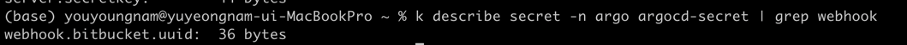

# ArgoCD 운영 최적화


최근 운영 중인 클러스터에서 자주 장애가 발생하는 이슈가 있었습니다. 원인을 조사한 결과, ArgoCD가 주요 원인중 하나임을 확인했습니다. 초기에는 기본 구성으로 ArgoCD를 배포하고 운영해 왔지만, 시간이 지나면서 점점 늘어나는 클러스터와 Application 수로 인해 문제가 발생하기 시작했습니다.

현재 단일 ArgoCD에 10개 이상의 클러스터가 연결되어 있으며, ArgoCD가 관리하는 Application 수도 300개 + 이상으로 증가한 상태입니다.


## 발견된 문제점
- 단일 application-controller의 CPU 및 메모리 사용량 급증 (스파이크)
- CICD 실행 시 argocd-application, argocd-repo-server의 CPU 사용량 급증


## 적용한 최적화 방식
- Pull 방식에서 Push 방식으로 변경
- application-controller HA 구성
- argocd-repo-server 옵션 최적화


### Application Controller 최적화 
- HA 구성
  - ArgoCD가 관리하는 클러스터가 점차 많아질 수 록 ArgoCD의 Application Controller는 더 많은 cpu와 memory가 소비될 수 있습니다. 특이점이 왔을 때 Replicas를 늘려 관리하는 클러스터를 나눠서 운영할 수 있게 해주는게 좋습니다.
  - 단순히 replicas만 늘린다고 해서 해결되지는 않고,  Kubernetes 클러스터의 서브셋을 담당하도록 구성해야 합니다. 해당값 조정은 ARGOCD_CONTROLLER_REPLICAS option을 조절하면 됩니다. 
```shell
         - name: ARGOCD_CONTROLLER_REPLICAS
           value: "2"
```


### pull 방식에서 push 방식으로 변경 
- ArgoCD는 default로 pull 방식을 통해서 매 3분마다 application manifest를 체크해서 변경사항을 체크합니다. 
- 단일 Application update될 때마다 전체 레포에 대한 캐시가 무효화가 됩니다. 
- 변경된 Application만 Webhook 트리거를 통해 argocd에게 전달을 하고 동기화를 진행할 수 있도록 했습니다. 


```shell
# bitbucket push webhook
 k get secret -n argo argocd-secret 
  # bitbucket webhook Header에 있는 X-Hook-UUID값으로 넣어주기 
  webhook.bitbucket.uuid: bitbucket webhook X-Hook-UUID 
  

# argocd application annotation
apiVersion:  argoproj.io/v1alpha1 
kind:  application
metadata: 
  name:  example-guestbook 
  namespace:  argo
  annotations: 
    # 'guestbook' 디렉토리로 경로
    # 동기화될 application 위치를 작성해야합니다. 
    argocd.argoproj.io/manifest-generate-paths:  . 
spec: 
  source: 
    repoURL:  https://argocd-repo.git 
    targetRevision:  HEAD 
    path:  guestbook 
```
```shell
# 적용되었는지 확인
k describe secret -n argo argocd-secre
```


참고자료
- https://argo-cd.readthedocs.io/en/stable/operator-manual/high_availability/


## Argocd repo server option 최적화
```shell
 reposerver.enable.git.submodule: "false"
 reposerver.kubectl.parallelism.limit: "3"
 reposerver.parallelism.limit: "3" # 애플리케이션이 동기화하는데 영향이 있을 수 있습니다.
 reposerver.repo.cache.expiration: 6h
```

## 정리 및 옵션 설명 

ArgoCD Gitops의 기본적인 원리를 간단하게 설명하겠습니다. Git 저장소에 쿠버네티스 리소스를 manifest를 선언하여 단일 진실 공급원(SSOT)방식으로 운영합니다. 
ArgoCD는 이 상태를 지속적으로 관찰하며 현재 클러스터에 배포된 애플리케이션 상태와 git의 상태를 비교하여 다르면 Git의 상태에 맞게 배포합니다. 

reposerver.parallelism.limit 옵션은 Git 저장소 동기화 순서를 제어합니다.

reposerver.kubectl.parallelism.limit: Kubernetes 리소스 병렬 배포 제어합니다.

reposerver.repo.cache.expiration: Git 저장소 캐시 만료 시간 설정합니다. 

그렇다면 reposerver.repo.cache.expiration 어떤역할을 할까요? Git의 저장소를 매번 다운로드 하지않습니다. 변경된 부분만 빠르게 배포합니다. 


한번 실제로 변경된 부분만 체크하는지 확인해봅시다. 
```shell
argocd app get remote-user


Name:               argo/remote-user
Project:            default
Server:             https://kubernetes.default.svc
Namespace:          default
URL:                https://x.x.x.x/applications/example-remote-app
Target:             main
Path:               frontend/remote-app/overlays/dev
SyncWindow:         Sync Allowed
Sync Policy:        Automated (Prune)
Sync Status:        Synced to dev (2f97addw)
Health Status:      Healthy

GROUP  KIND        NAMESPACE  NAME                     STATUS  HEALTH   HOOK  MESSAGE
       ConfigMap   default        remote-app-config   Synced                 configmap/example-remote-app-config unchanged
       ConfigMap   default        example-remote-app  Synced                 configmap/example-remote-app configured
       Service     default        example-remote-app  Synced  Healthy        service/example-remote-app unchanged
apps   Deployment  default        example-remote-app  Synced  Healthy        deployment.apps/example-remote-app configured
```

각 옵션들은 환경에 맞게 테스트를 해야합니다. 추가적으로 ArgoCD를 운영하면서 최적화를 더 할 수 있는 부분이 생긴다면 업데이트하도록 하겠습니다.


### 참고 문서
- https://argo-cd.readthedocs.io/en/release-2.2/operator-manual/server-commands/argocd-repo-server/
- https://argo-cd.readthedocs.io/en/stable/operator-manual/argocd-cmd-params-cm-yaml/
- https://argo-cd.readthedocs.io/en/stable/operator-manual/high_availability/


### ArgoCD에서 설정할 수 있는 param cm을 확인할 수 있는 공식문서
https://argo-cd.readthedocs.io/en/latest/operator-manual/server-commands/additional-configuration-method/


