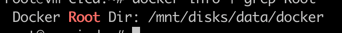

# Docker Root 경로 변경하기

**Docker Root Dir**은 Docker가 이미지, 컨테이너, 볼륨, 네트워크 등의 데이터를 저장하는 기본 디렉토리 경로입니다.

그렇다면, Docker root 경로를 기본 `/var/lib/docker`가 아닌 다른 디스크 경로로 변경하려면, Docker의 데이터 루트를 변경해야 합니다.

### **1. Docker 서비스 중지**

```bash
bash

sudo systemctl stop docker

```

### **2. 새로운 저장 경로 생성 및 마운트 (예: `/mnt/docker` 사용) mount된 경로 있어서 선택사항**

만약 이미 디스크를 `/mnt/docker`로 마운트했다면 이 과정은 건너뛰어도 됩니다.

```bash
bash

sudo mkdir -p /mnt/docker

```

기존 Docker 데이터를 새로운 경로로 복사하려면:

```bash
bash

sudo rsync -aP /var/lib/docker/ /mnt/disk/data/docker

```

### **3. Docker 데몬 설정 변경**

Docker의 데이터 저장 경로를 변경하려면 `/etc/docker/daemon.json`을 수정해야 합니다.

```bash

sudo vi /etc/docker/daemon.json

```

아래 내용을 추가하거나 수정합니다:

```json

{
  "data-root": "/mnt/disk/data/docker"
}

```

### **4. 기존 Docker 데이터 백업 및 제거 (선택 사항)**

(만약 새로운 경로로 데이터를 복사했다면 기존 데이터 삭제 가능)

```bash

sudo mv /var/lib/docker /var/lib/docker.bak

```

### **5. Docker 서비스 재시작**

```bash

sudo systemctl daemon-reload (설치 되어 있으면)
sudo systemctl restart docker

```

### **6. 변경 사항 확인**

Docker가 정상적으로 새로운 경로를 사용하는지 확인하려면:

```bash

docker info | grep "Docker Root Dir"

```

출력 예시:




이제 `docker images` 명령어를 실행하면 새로운 경로에 저장된 이미지가 표시됩니다. 🚀

### 7. Docker Restart

```bash
systemctl restart docker
```

### 8. Docker 재실행 후 문제 없는지 확인하고 기존 경로 제거

```bash
rm -r /var/lib/docker/ 
```