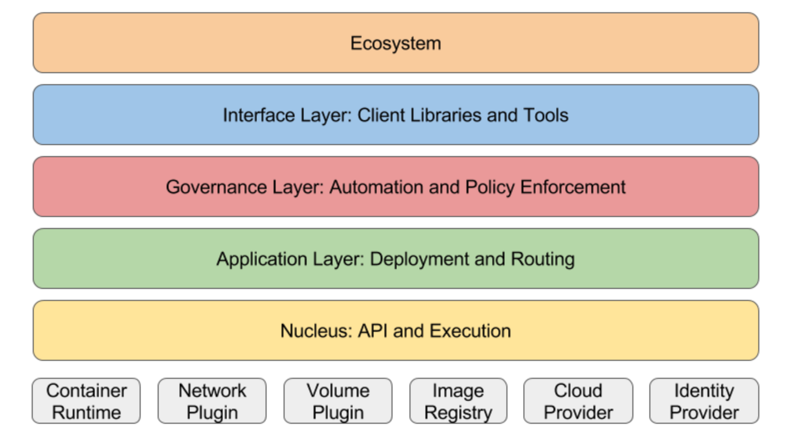

# Kubernetes System layers


쿠버네티스를 공부를 하다보면, 쿠버네티스의 원론적인 부분이 궁금해질 때가 생깁니다. 이시스템이 왜 지금 필요한것인가? 또는 어떻게 설계되었는가? 등등..

저역시 쿠버네티스를 깊게 알고 있는 상태는 아니기 때문에 문서를 찾아보다가 Kubernetes GitRepo **Kubernetes Design Proposals Archive** 라는 Repo를 발견했는데요. 이 Repo는 쿠버네티스가 어떠한 철학으로 설계했는지 왜 이런구조로 설계할 수 밖에 없는지에 대한 역사적 참고용?레포 인것을 발견했습니다.


Kubernetes Design Proposals Archive를 보다가 Kubernetes System layers라는 문서를 봤는데 흥미로워서 번역 + 제가 이해한 바탕으로 작성해봤습니다.


## Kubernetes System Layers

 # 출처넣기 

최하위 계증인 Nucleus: API and Execution
쿠버네티스 시스템을 구성하는 가장 본질적인 API들과 실행 기능들을 의미합니다.

여기서 말하는 API와 기능들은 모두 Upstream Kubernetes 코드베이스(공식 커뮤니티 코드) 안에 구현되어 있으며,
**쿠버네티스 전체 구조의 상위 계층(예: 워크로드 관리, 스케줄링, 오토스케일링 등)** 을 쌓아 올리기 위해 반드시 필요한 최소 단위(feature set)입니다.

즉, System Layers에서 Nucleus는 쿠버네티스의 심장과도 같은 핵심 계층입니다.

여기서 Kubernetes Nucleus는 무엇일까요?
- Kubernetes API Server (Authentication, Authorization, Admission)
- Controller Manager (Garbage Collection, Replication Controllers, etc)
- Scheduler
- Etcd (Persistent Storage for API Objects)
- CRI (Container Runtime Interface: containerd, CRI-O)
- CNI (Container Network Interface)
- CSI (Container Storage Interface)

Kubernetes 클러스터는 kube-apiserver, kubelet, controller-manager, scheduler, etcd와 같은 핵심 컴포넌트로 구성됩니다. 이 중 하나라도 정상적으로 동작하지 않으면, 클러스터의 기능이 제한되거나 리소스 생명주기 관리가 불가능해집니다.

특히, kube-apiserver는 클러스터의 관문 역할을 하며, etcd는 모든 상태 정보를 저장하는 저장소, kubelet은 파드 실행을 담당하는 실행 엔진, controller-manager는 리소스 상태를 지속적으로 유지 관리하는 컨트롤러 집합, scheduler는 파드를 적절한 노드에 배치하는 역할을 수행합니다.


Application Layer: Deployment and Routing(애플리케이션 계층)

이 계층은 애플리케이션 관리 및 구성 레이어로, 자가 복구(self-healing), 스케일링, 애플리케이션 수명주기 관리, 서비스 디스커버리, 로드 밸런싱, 라우팅 등을 제공합니다. 이는 흔히 오케스트레이션이라고 불립니다.


자가복구, 스케일링 애플리케이션 수명주기 관리, 서비스 디스커버리, 로드 밸런싱, 라우팅 없다면 컨테이너기반의 애플리케이션은 실행될 수 없습니다. 컨테이너화된 애플리케이션들은 이 기능들 중 하나 이상을 반드시 사용합니다. 

기본 스케줄러(Default Scheduler)
- Pod API에 정의된 스케줄링 정책(리소스 요청, nodeSelector, affinity, anti-affinity, taint, tolerations)을 구현합니다.


Continuously running applications(지속적으로 실행되는 애플리케이션)

지속적으로 실행되는 애플리케이션 같은 애플리케이션은 모두 다음 기능을 지원해야 합니다.
- 선언적 업데이트(declarative updates)를 통한 롤아웃(배포) 및 롤백
- DaemonSet을 제외하고, 모든 리소스는 수평 확장(horizontal scaling) 을 지원해야 합니다.


Discovery, load balancing, and routing(서비스 디스커버리, 로드 밸런싱 및 라우팅)
- 클러스터 IP 할당
  - kubernetes는 Service를 생성할 때 클러스터 내에서만 접근 가능한 고정 IP(ClusterIP) 를 자동으로 할당해준다.
    이 IP는 파드가 재시작되거나 IP가 바뀌어도 변하지 않기 때문에, 내부 통신이 안정적
- 서비스 할당 맵 복구
  - 예를 들어 어떤 이유로 service IP 할당이 꼬이거나, Endpoint와 Service 매핑이 깨지면
    Kubernetes는 자동으로 이를 탐지하고 복구하는 로직을 내장하고 있습니다.
- kube-proxy 또는 동등한 컴포넌트를 통한 로드밸런싱
  - kube-proxy는 클러스터 내부 트래픽을 적절한 파드(Endpoints)로 분산 처리해주는 핵심 컴포넌트입니다.
    - iptables, ipvs, userspace
- 서비스에 대한 자동 Endpoints 생성, 유지, 삭제
  - Service가 만들어지면, 현재 살아있는 파드 IP 목록(Endpoints) 을 실시간으로 관리한다.
    파드가 죽거나 새로 뜨면 Service에 자동 반영됩니다.
- LoadBalancer 타입 서비스는 선택사항(OPTIONAL) 이지만, 제공하는 경우 호환성 테스트를 통과해야 합니다.


애플리케이션 계층은 다음 구성 요소에 의존할 수 있습니다. 클러스터 내부 인증, ingress Controller(ingress Resource를 선언한다고 해서 끝이아니라, 실제 라우팅을 하는 ingress Controller가 필요), scheduler

DNS Service
Coredns는 기본적으로 사용하지만, 필요하다면 다른 시스템으로 대체될 수 있습니다 단, Kubernetes가 요구하는 DNS 네이밍 스키마(cluster.local 등) 는 반드시 준수해야 합니다.


kube-proxy 대체
kube-proxy 대신 다른 네트워크 트래픽 처리 솔루션이 있습니다.
- cilium
- Calico

kube-proxy 없이 더 빠르고 강력한 트래픽 라우팅이 가능해질 수도 있습니다. 


Governance Layer

Governace Layer의 API 및 기능들은 Container 실행을 위해 필수는 아니지만, 조직적 운영, 보안, 거버넌스를 위해 매우 중요하다고 합니다.

Governace Layer의 고려해야할 요소는 아래와 같습니다.
- CPU, Memory 자원 사용량
- 노드 간 내부 격리
- 최종 사용(end user) 제약
- 관리자(admin) 접근제어
- Dos(서비스 거부 공격) 방어

Metrics API
역할: HPA/VPA와 스케줄러에 메트릭을 제공하는 기반 API

Kubernetes는 metrics-server 또는 Prometheus 기반 Custom Metrics Adapter를 통해 메트릭을 노출합니다.

주로 사용하는 메트릭:

cpu, memory 사용량

network, storage, 사용자 정의 메트릭 등

```shell
metrics.k8s.io/v1beta1
GET /apis/metrics.k8s.io/v1beta1/pods

```

HorizontalPodAutoscaler (HPA) API
   역할: 파드의 수를 자동으로 조절하여 트래픽이나 리소스 부하에 대응

CPU 사용률, 메모리 사용률, 사용자 정의 메트릭 기준으로 파드 수를 조정

최소/최대 파드 개수와 목표 메트릭 설정 가능

````shell
apiVersion: autoscaling/v2
kind: HorizontalPodAutoscaler
spec:
  scaleTargetRef:
    apiVersion: apps/v1
    kind: Deployment
    name: my-app
  minReplicas: 2
  maxReplicas: 10
  metrics:
    - type: Resource
      resource:
        name: cpu
        target:
          type: Utilization
          averageUtilization: 70
````

Cluster Autoscaler / Node Provisioning
역할: 파드를 스케줄할 자원이 부족할 경우 노드를 자동으로 확장 또는 축소

GKE, EKS, KubeSpray, OpenStack 등 다양한 환경에서 지원

사용되지 않는 노드는 자동으로 제거 가능 (idle detection)

```shell
🔹 동작 시나리오
Pending 파드가 있을 때 → 새로운 노드 프로비저닝
일정 시간 리소스를 사용하지 않으면 → 노드 삭제
```

PodDisruptionBudget (PDB) API
역할: 유지보수나 롤링 업데이트 중 파드가 동시에 너무 많이 중단되지 않도록 보장

최소 몇 개의 파드를 유지해야 하는지 설정 가능

예기치 않은 서비스 중단 방지

```shell
apiVersion: policy/v1
kind: PodDisruptionBudget
metadata:
  name: web-pdb
spec:
  minAvailable: 2
  selector:
    matchLabels:
      app: web
```


동적 볼륨 프로비저닝 (Dynamic Volume Provisioning)
역할: PVC가 생성될 때 자동으로 PV를 생성

사용자는 PVC만 정의하면 되며, 백엔드에서는 StorageClass에 따라 PV를 생성

CSI, AWS EBS, GCE PD, NFS 등 다양한 드라이버와 연동 가능

```shell
apiVersion: v1
kind: PersistentVolumeClaim
spec:
  storageClassName: customStorage
  accessModes:
    - ReadWriteOnce
  resources:
    requests:
      storage: 10Gi
```

StorageClass API
역할: 어떤 스토리지 타입을 어떤 방식으로 동적으로 생성할지 정의

여러 개의 StorageClass를 만들어 다양한 성능/비용 정책 적용 가능

기본 StorageClass 하나는 클러스터에 반드시 존재

```shell
apiVersion: storage.k8s.io/v1
kind: StorageClass
metadata:
  name: fast
provisioner: kubernetes.io/aws-ebs
parameters:
  type: gp2

```


RBAC 권한 정책 (Authorization)

RBAC (Role-Based Access Control)
**역할(Role)**을 기반으로 사용자 또는 서비스 계정의 접근 권한 제어

역할(Role)은 리소스 단위로 "get, list, create, delete, update" 등 세부 권한을 설정 가능

Role - 네임스페이스 범위의 권한정의

ClusterRole - 클러스터 전체 범의 권한정의

RoleBinding - Role을 사용자/그룹/서비스계정에 바인딩 (네임스페이스 범위)

ClusterRoleBinding - ClusterRole을 클러스터 범위에서 바인딩

LimitRange API
역할: 컨테이너/파드의 최소/최대 리소스 요청(requests)과 제한(limits)을 강제

CPU, Memory 등의 자원 설정이 누락되었을 경우 기본값 적용

팀/유저가 과도한 자원 요청을 못 하도록 제한 가능

```shell
apiVersion: v1
kind: LimitRange
metadata:
  name: resource-limits
  namespace: dev
spec:
  limits:
  - default:
      cpu: 500m
      memory: 512Mi
    defaultRequest:
      cpu: 200m
      memory: 256Mi
    type: Container

```


ResourceQuota API
역할: 네임스페이스별 리소스 사용량 제한

CPU, 메모리, 파드 수, PVC, Service 수 등 제한 가능

리소스를 “공정하게” 분배하고 클러스터 자원 남용 방지

```shell
apiVersion: v1
kind: ResourceQuota
metadata:
  name: dev-quota
  namespace: dev
spec:
  hard:
    requests.cpu: "2"
    requests.memory: 4Gi
    limits.cpu: "4"
    limits.memory: 8Gi
    pods: "10"
```

PodSecurityPolicy API (PSP)
역할: 파드의 보안 관련 설정을 정책으로 강제

예: root로 실행 금지, hostPath 마운트 금지, 특정 capabilities 제거 등

Kubernetes 1.25부터 정식 제거됨(deprecated) 

대안: OPA Gatekeeper, Kyverno 사용 권장


ImageReview API
역할: 파드가 사용할 컨테이너 이미지가 보안 정책에 맞는지 검토

Admission Webhook으로 동작

예: 특정 Registry만 허용, 이미지 서명 확인 등

일반적으로 Open Policy Agent (OPA) 또는 Gatekeeper와 함께 사용


NetworkPolicy API
역할: 파드 간 네트워크 통신을 제어 (기본적으로 모두 허용 → 명시적으로 허용할 대상만 지정)

동작을 위해 NetworkPolicy를 지원하는 CNI 플러그인 필요

예: Calico, Cilium, Antrea, Weave


Governance Layer는 클러스터의 안전하고 예측 가능한 운영을 위해, 리소스 제한, 보안 정책, 사용자 권한, 자동화 규칙을 정의하고 강제하는 계층입니다. 
즉, 클러스터 DevOps 엔지니어, 개발자들은 원하는대로 파드를 올리지만, Governance Layer는 1 Core 이상 쓰면안돼, 해당 이미지는 외부에서 가져오는 이미지라서 배포 금지
와같은 보안 정책 필터 역할을 합니다. 


인터페이스 계층: 라이브러리와 도구 (The Interface Layer: Libraries and Tools)

이 계층은 쿠버네티스 배포판에서 권장되는 구성 요소이며, 동시에 사용자가 직접 다운로드하고 설치하여 활용할 수 있는 도구 및 라이브러리를 포함합니다. 여기에는 쿠버네티스 공식 프로젝트에서 개발한 자주 사용하는 라이브러리, 툴, 시스템, 사용자 인터페이스(UI) 등이 포함되며, 유사한 기능을 수행하는 서드파티 도구로 대체 가능하기도 합니다.

이 계층의 요소들은 종종 공식 예제나 실습 문서에서 사용되며, 개발자와 운영자 모두가 실무에서 활용하는 쿠버네티스 인터페이스 도구 모음이라 볼 수 있습니다.


- Kubectl
  - 쿠버네티에서 가장 널리사용되고 있는 CLI도구지만, 핵심은 kubernetes를 사용하는데 있어서 특권의 도구가 아니라 여러 클라이언트 도구중 하나로 바라보고 있습니다.
  - 장기적으로 kubectl 복잡한 기능을 사용하지 않고 그런기능들을 쿠버네티스 api로 옮겨 경량화를 하는게 목표라고 합니다. 
- Client 라이브러리 
  - 다양한 언로 작성된 라이브러리 
    - client-go, client-python
    - 이들 라이브러리는 자동화 툴, 연동 시스템, 사용자 정의 컨트롤러 등을 개발할 때 활용됩니다.
- 클러스터 페더레이션 (Federation)
  - kubefed 및 관련 API 서버, 컨트롤러 등을 포함
  - 여러 쿠버네티스 클러스터를 하나의 논리 단위로 관리하고 싶을 때 사용
- Helm 
  - 쿠버네티스에서의 패키지 매니저 역할을 수행합니다. 
  - 복잡한 애플리케이션 배포를 템플릿 기반으로 선언하고, 버전 관리 및 Rollback 등을 제공합니다.


이 계층은 실제 클러스터와 개발자의 접점을 구성하는 **도구 생태계**로 볼 수 있으며, 쿠버네티스를 더 쉽게, 더 강력하게 사용할 수 있게 해주는 사용자 경험 계층입니다.