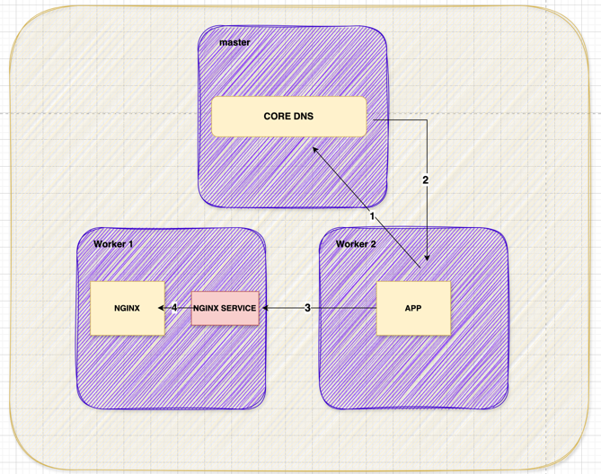
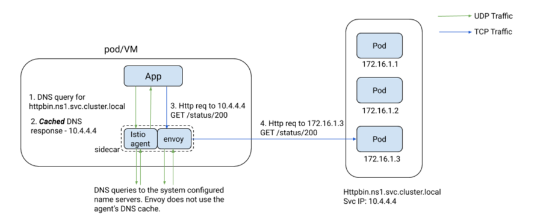
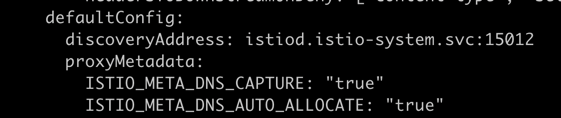
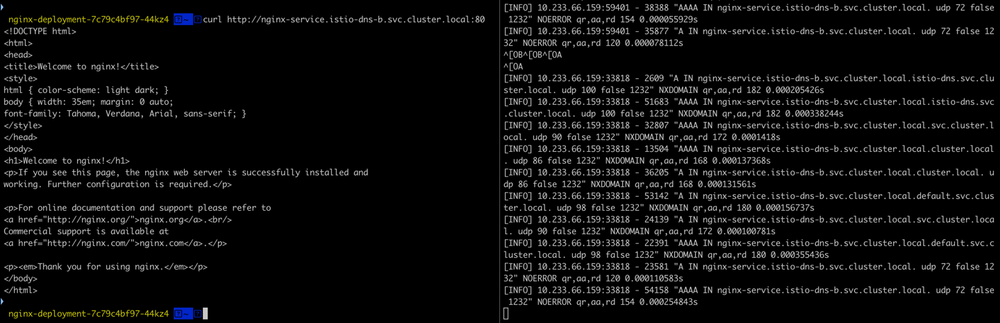
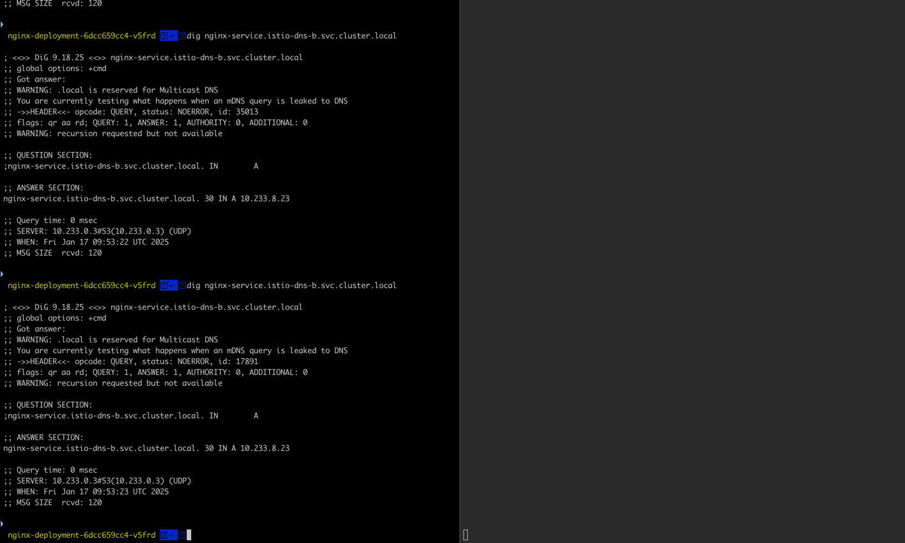

# Istio DNS Proxy Cache를 이용하여 Core DNS 개선하기 


### Kubernetes의 CoreDNS의 역할
- CoreDNS는 경량화된 설계로 클라우드 네이티브 환경에 최적화되어 있습니다.
- 플러그인 기반으로 다양한 기능을 추가할 수 있어 고도로 확장 가능합니다.
- **Pod-to-Pod 통신**: CoreDNS를 통해 IP 주소 대신 **DNS 이름**을 사용하여 다른 서비스와 통신할 수 있습니다.
- **DNS 규칙**: Kubernetes 네임스페이스 및 서비스 이름 규칙에 따라 요청을 처리합니다.
- **가상 네트워크 관리**: Kubernetes 클러스터 내에서 네트워크 요청을 효율적으로 처리합니다.


### 위에서 말하는 DNS 규칙이 무엇일까요?
**서비스 디스커버리**
- 서비스 디스커버리를 짧게 설명해보자면, 쿠버네티스 내에 배포된 서비스들이 존재하고, 해당 서비스들을 통신을 가능하게 하는 중요한 메커니즘 입니다.
- 서비스 디스커버리는 애플리케이션(POD)가 동적으로 생성되고 종료되더라도 안정적이고 일관된 방식으로 통신을 지원합니다. 
- 즉, pod는 pod-cidr를 통해 ip를 할당 받고 파드가 죽어서 다른 ip를 할당 받게된다면, 이를 일관된 방식으로 통신을 할 수 있게 해줄 수 있게 해주는 방식입니다. 


### Pod가 다른 서비스인 Pod를 찾는 방법




간단하게 그림을 통해 설명해보자면
1. Worker2번에 올라가 있는 Pod가 Worker1번에 있는 Nginx Pod를 찾을 수 있는 방법은 첫번째로 APP파드가 CoreDNS에게 nginx.default.svc.cluster.local로 질의를 합니다.
  2. CoreDNS는 해당 DNS(FQDN)에 해당하는 service ip를 다시 APP에게 전달합니다.
  3. APP은 service ip를 가지고 nginx와 통신을 하게 됩니다. 

실제로는 kube-proxy, iptables, CNI 등 더 많은 컴포넌트들이 관여하는 복잡한 과정이 있습니다. 


### Istio가 어떻게 CoreDNS 부하를 감소시킬 수 있을까요?

https://istio.io/latest/blog/2020/dns-proxy/#automatic-vip-allocation-where-possible

- Istio는 기존에 많이 알려진것처럼, Service Mesh입니다. 그렇다면, Service Mesh는 무엇일까요? Service Mesh는 공식문서를 보면 가시성과 트래픽관리 그리고 보안을 담당하고 있는 인프라스트럭쳐 계층이라고 설명되어 있습니다. 
- Istio하면 따라다니는게 있는데 그건 바로 Envoy입니다.  istio sidecar인 **Envoy**가 CoreDNS 부하를 감소 시킬 수 있습니다.
- 짧게 설명해보자면, istio sidecar인 Envoy가 이미 Serive Discovery(FQDN)에 대한 servive-ip를 cache처럼 활용하는 것입니다.


### Istio DNS Cache 설정 방법

현재 해당기능은 기본적으로 istio를 설치를 진행하면 설정되지는 않습니다. 그래서 istio configmap를 수정 후 istiod pod를 재시작합니다.




### Istio DNS Cache 활성화 확인 

#### ISTIO DNS Cache설정이 적용된 istio sidcar config 상태
Istio DNS Cache가 제대로 활성화되었는지 확인하려면 아래 명령어를 실행합니다
```shell
#활성화된 경우 출력 예시:
 k exec -it -n cmp pod_name -c istio-proxy -- curl localhost:15000/config_dump | grep -i dns
 
        "ISTIO_META_DNS_CAPTURE": "true",
        "DNS_CAPTURE": "true",
        "ISTIO_META_DNS_AUTO_ALLOCATE": "true"
      "DNS_CAPTURE": "true",
      "DNS_AUTO_ALLOCATE": "true",
       "name": "envoy.matching.inputs.dns_san",
        "envoy.extensions.matching.common_inputs.ssl.v3.DnsSanInput"
       "name": "envoy.cluster.logical_dns",
       "name": "envoy.cluster.strict_dns",
       "name": "envoy.filters.udp.dns_filter",
        "envoy.extensions.filters.udp.dns_filter.v3.DnsFilterConfig"
       "name": "envoy.network.dns_resolver.cares",
       "category": "envoy.network.dns_resolver",
        "envoy.extensions.network.dns_resolver.cares.v3.CaresDnsResolverConfig"
       "name": "envoy.matching.inputs.dns_san",
        "envoy.extensions.matching.common_inputs.ssl.v3.DnsSanInput"
      "name": "outbound|53||coredns.kube-system.svc.cluster.local",
       "service_name": "outbound|53||coredns.kube-system.svc.cluster.local"
           "name": "coredns",
           "host": "coredns.kube-system.svc.cluster.local"
```
#### ISTIO DNS Cache설정이 적용되지 않은 istio sidcar config 상태

```shell
#비활성화된 경우 출력 예시
k exec -it -n cmp pod name -c istio-proxy -- curl localhost:15000/config_dump | grep -i dns


       "name": "envoy.matching.inputs.dns_san",
        "envoy.extensions.matching.common_inputs.ssl.v3.DnsSanInput"
       "name": "envoy.filters.udp.dns_filter",
        "envoy.extensions.filters.udp.dns_filter.v3.DnsFilterConfig"
       "name": "envoy.cluster.logical_dns",
       "name": "envoy.cluster.strict_dns",
       "name": "envoy.network.dns_resolver.cares",
       "category": "envoy.network.dns_resolver",
        "envoy.extensions.network.dns_resolver.cares.v3.CaresDnsResolverConfig"
       "name": "envoy.matching.inputs.dns_san",
        "envoy.extensions.matching.common_inputs.ssl.v3.DnsSanInput"
```
### CoreDNS 로그에서의 차이

#### Istio Cache 적용 시



위 이미지에 보이는것처럼 파드 내부에서 다른 namespace에 있는 nginx pod에 요청을 할 때 coredns 로그에 dns 질의를 하는것을 볼 수 있습니다.


#### Istio Cache 미적용 시 



Istio Cache가 istiod에 적용된 뒤 위 방식처럼 다시 파드 내부에서 다른 파드에 요청했을 때 coredns에 들어오지 않는것을 확인할 수 있습니다. 


### 결론
Istio의 DNS Proxy Cache는 CoreDNS의 부하를 줄이고, 서비스 디스커버리의 성능을 최적화하는 강력한 도구입니다.