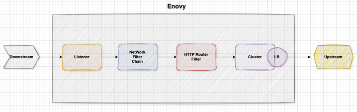

# Istio Envoy에 대해 궁금하다.


**Enovy**란 무엇일까요? 재미있는 비유를 해보자면, istio는(조폭 두목)이고 Enovy는(행동대장)관계입니다. 
조폭두목은 직접적으로, 싸우지는 않지만, 전체적으로 전략을 짜고 명령을 내리죠. 그러면 행동대장인 Envoy는 두목의 명령을 받아서 실제로 움직이는 실무자라고 생각하시면 됩니다. 

- **시나리오**
  - "A구역을 우리가 앞으로 관리할거야 거기로 지나다니는(트래픽) 사람들 관리해" -> 두목(istio)
  - "요새 이상한 사람들이 우리 구역에 들어오는거 같아 외부에서 함부로 못들어오게 막아" -> 두목(istio)
  - "알겠습니다. 두목 A구역으로 들어오는 사람들을 관리하겠습니다." -> 행동대장(Envoy)
  - "외부에서 이상한사람이 접근(비정상 트래픽)이 오면 출입증 부탁드립니다. 검사" -> 행동대장(Envoy)


**Envoy**의 구조를 한번 봅시다. 
<p align="center">
  
</p>

이미지에 보이는 것처럼 **Envoy Proxy**는 Proxy역할을 하게됩니다. 즉, 외부(클라이언트)로부터 Envoy로 들어오는 요청을 **DownStream** 요청을 받아서 Service(Container)로 전달하는것을 **UpStream**으로 생각하시면 됩니다. 


**Listener**
-  Listener는 Envoy가 클라이언트 요청(Downstream)을 받아들이는 진입점입니다. 여러 개의 Listener를 설정할 수 있으며, 각각 특정 포트에서 트래픽을 수신합니다. 필터 체인을 통해 트래픽을 검사하고, 적절한 Upstream(Cluster)으로 전달합니다.


**Network Filter Chain**
- Listener로 들어온 요청에 대해 처리하는것이라고 생각하면 됩니다.(예를들어: 인증, 로깅, 트래픽변환, 요청차단 등등..) 
- 비유를 해보자면, TCP Proxy 필터: envoy.filters.network.tcp_proxy → TCP 트래픽을 특정 Cluster로 전달
  HTTP Connection Manager: envoy.filters.network.http_connection_manager → HTTP 요청을 처리하고, 라우팅(RDS) 적용


**Cluster**
Cluster는 Envoy에서 특정 백엔드 서비스 그룹을 의미하는 논리적인 개념입니다.
즉, Envoy가 트래픽을 전달할 대상(서버 그룹) 을 정의하는 부분입니다.

Istio의 Envoy Proxy가 트래픽을 보낼 곳(서비스) 여러 개의 엔드포인트(Endpoints) 로 구성  로드 밸런싱, 서비스 디스커버리, 헬스 체크 등을 수행

예를 들어, 특정 서비스(reviews.default.svc.cluster.local)로 트래픽을 보내야 한다면, Envoy는 이 서비스에 대한 Cluster를 설정하고, 해당 클러스터에 포함된 엔드포인트를 통해 요청을 전달합니다.


**BlackHoleCluster**는 요청이 어디에도 매칭되지 않았을 때 Envoy가 사용하며, 기본적으로 503(Service Unavailable) 응답을 반환합니다. 이는 정의된 라우팅 경로가 없는 요청을 차단하는 데 사용됩니다.


글로만보면 이해가 되지만, 실제로 Sidecar로 달려있는 Enovy 설정을 본다면 이해가 더 잘됩니다. 모든 설정은 다보기엔 너무 많으니 일부 설정을 같이함께 봅시다.

```shell
- address:
    socketAddress:
      address: 0.0.0.0
      portValue: 15006
  continueOnListenerFiltersTimeout: true
  filterChains:
  - filterChainMatch:
      destinationPort: 15006
    filters:
    - name: istio.metadata_exchange
      typedConfig:
        '@type': type.googleapis.com/udpa.type.v1.TypedStruct
        typeUrl: type.googleapis.com/envoy.tcp.metadataexchange.config.MetadataExchange
        value:
          enable_discovery: true
          protocol: istio-peer-exchange
    - name: istio.stats
      typedConfig:
        '@type': type.googleapis.com/stats.PluginConfig
        disableHostHeaderFallback: true
    - name: envoy.filters.network.tcp_proxy
      typedConfig:
        '@type': type.googleapis.com/envoy.extensions.filters.network.tcp_proxy.v3.TcpProxy
        cluster: BlackHoleCluster
        statPrefix: BlackHoleCluster
    name: virtualInbound-blackhole
  - filterChainMatch:
      applicationProtocols:
      - istio-http/1.0
      - istio-http/1.1
      - istio-h2
      transportProtocol: tls
```

위 설정은 배포된 파드의 사이드카 listeners중 일부를 가져왔습니다. 

**15006** port는 이스티오의 인바운드 트래픽을 처리하는 것입니다. 15006으로 들어오게되면 iptables rule에 의해 app으로 Redirect가 되고 해당 패킷은 app으로 전달됩니다. 

**continueOnListenerFiltersTimeout: true** Listener 필터가 타임아웃되 요청을 계속 하는지에 대한 옵션입니다.

**- filterChainMatch:
  destinationPort: 15006** 목적지 포트가 15006인 경우에만 이 체인을 적용하는것입니다.
즉, Inbound 트래픽이 15006으로 접근을하게되면 이 필터 체인이 적용됩니다.

```shell
filters:
- name: istio.metadata_exchange
  typedConfig:
  '@type': type.googleapis.com/udpa.type.v1.TypedStruct
  typeUrl: type.googleapis.com/envoy.tcp.metadataexchange.config.MetadataExchange
  value:
  enable_discovery: true
  protocol: istio-peer-exchange

```
**metadata_exchange** Istio에서 서비스 간 메타데이터(metadata) 교환을 활성화하는 역할을 합니다.
이는 Envoy 간 통신에서 메타데이터를 교환하여 트래픽 라우팅 및 정책 적용을 가능하게 합니다. 주로 Telemetry, Authorization, Service Discovery 등에 활용됩니다.


Istio mTLS (Mutual TLS) 활성화 시 함께 사용되어 트래픽 측정 및 정책 적용에 활용됩니다.

Envoy 프록시가 통신할 때 서로 메타데이터를 교환하며, 이를 기반으로 트래픽을 분석하거나 정책을 적용할 수 있습니다.
보통 Inbound 및 Outbound 필터 체인에 추가되어 사용됩니다.

```shell
    - name: istio.stats
      typedConfig:
        '@type': type.googleapis.com/stats.PluginConfig
        disableHostHeaderFallback: true

```

Istio의 통계(Stats) 필터를 사용하도록 지정합니다.
Envoy는 Istio를 통해 요청 및 응답 정보를 수집하고, 이를 Prometheus 등의 모니터링 시스템에 전달할 수 있습니다.


## xDS

**xDS(eXtensible Discovery Service)**: xDS는 Envoy Proxy가 동적으로 구성을 업데이트할 수 있도록 하는 API 프로토콜입니다. Istio에서도 Envoy를 데이터 플레인으로 사용하며, xDS를 통해 제어 플레인에서 Envoy 설정을 동적으로 관리합니다.


#### Envoy와 Istiod는 어떻게 통신을 하며 동적으로 업데이트를할까요? 

Enovy Proxy가 동적으로 업데이트를 할 수 있는 이유는 istiod와 지속적으로 연결을 유지하면서 변경 사항을 동적으로 반영합니다.이를 위해 Evoy는 GRPC 스트리밍 방식 또는 주기적으로 풀링방식으로 xDS 서버(istiod)와 통신을 합니다.


### LDS(Listener Discovery Service)
Envoy가 수신할 네트워크 리스너(Listener) 구성을 제공하는 API이면서, Istio Ingress Gateway나 Sidecar Proxy가 수신하는 포트와 필터 체인을 설정합니다.

Envoy가 수신할 네트워크 리스너 구성을 제공합니다. 클라이언트(DownStream)을 통해 들어온 트래픽을 어디로 보내야하는지에 대한 결정을 할 수 있을 뿐만 아니라, 필요한 필터체인을 적용하여 요청에 대해 처리할 수 있습니다. 또한 Listerner은 outbound에 대한 요청도 관리합니다.

아래는 envoy가 적용된 파드에 대한 listerner 상태입니다.

```shell
 istioctl pc listener nginx-deployment-f7786fdc7-75lmc.istio-dns-b
ADDRESSES     PORT  MATCH                                                               DESTINATION
10.233.0.3    53    ALL                                                                 Cluster: outbound|53||coredns.kube-system.svc.cluster.local
0.0.0.0       80    Trans: raw_buffer; App: http/1.1,h2c                                Route: 80
0.0.0.0       80    ALL                                                                 PassthroughCluster
.
.
.
.
.
0.0.0.0       15001 Addr: *:15001                                                       Non-HTTP/Non-TCP
0.0.0.0       15006 Addr: *:15006                                                       Non-HTTP/Non-TCP
0.0.0.0       15006 Trans: tls; App: istio-http/1.0,istio-http/1.1,istio-h2             InboundPassthroughCluster
0.0.0.0       15006 Trans: raw_buffer; App: http/1.1,h2c                                InboundPassthroughCluster
0.0.0.0       15006 Trans: tls; App: TCP TLS                                            InboundPassthroughCluster
0.0.0.0       15006 Trans: raw_buffer                                                   InboundPassthroughCluster
0.0.0.0       15006 Trans: tls                                                          InboundPassthroughCluster
0.0.0.0       15006 Trans: tls; App: istio-http/1.0,istio-http/1.1,istio-h2; Addr: *:80 Cluster: inbound|80||
0.0.0.0       15006 Trans: raw_buffer; App: http/1.1,h2c; Addr: *:80                    Cluster: inbound|80||
0.0.0.0       15006 Trans: tls; App: TCP TLS; Addr: *:80                                Cluster: inbound|80||
0.0.0.0       15006 Trans: raw_buffer; Addr: *:80                                       Cluster: inbound|80||
0.0.0.0       15006 Trans: tls; Addr: *:80                                              Cluster: inbound|80||
```
이스티오 envoy에서는 15001 port와 15006 port는 위에서 언급했듯이, 중요한 기능을 담당하는 포트입니다. 두개의 포트는 리다이렉션을 하기 위한 용도고 15001은 아웃바운드에 대한 포트, 15006은 인바운드에 대한 트래픽을 처리하는 용도입니다.


### RDS(Router Discovery Service)

RDS(Route Discovery Service)는 Listener에서 받은 요청을 특정 Cluster로 전달하는 라우팅 규칙을 관리합니다. Istio에서 VirtualService를 사용하여 라우팅 규칙을 정의하면, 해당 정보가 RDS를 통해 Envoy에 전달됩니다.


```shell
    includeRequestAttemptCount: true
    name: istio-gateway.istio-system.svc.cluster.local:80
    routes:
    - decorator:
        operation: istio-gateway.istio-system.svc.cluster.local:80/*
      match:
        prefix: /
      name: default
      route:
        cluster: outbound|80||istio-gateway.istio-system.svc.cluster.local
        maxGrpcTimeout: 0s
        retryPolicy:
          hostSelectionRetryMaxAttempts: "5"
          numRetries: 2
          retriableStatusCodes:
          - 503
          retryHostPredicate:
          - name: envoy.retry_host_predicates.previous_hosts
            typedConfig:
              '@type': type.googleapis.com/envoy.extensions.retry.host.previous_hosts.v3.PreviousHostsPredicate
          retryOn: connect-failure,refused-stream,unavailable,cancelled,retriable-status-codes
        timeout: 0s
  - domains:
    - nginx-service.istio-dns-b.svc.cluster.local
    - nginx-service
    - nginx-service.istio-dns-b.svc
    - nginx-service.istio-dns-b
    - 10.233.8.23
    includeRequestAttemptCount: true
```


### CDS(Cluster Discovery Service)

CDS는 Envoy가 트래픽을 라우팅할 대상(클러스터) 을 동적으로 업데이트하는 기능을 합니다.
즉, Istio의 Pilot(컨트롤 플레인) 이 Envoy 프록시(데이터 플레인) 에게 어떤 클러스터들이 존재하는지 알려주는 서비스입니다.

istio에서 Cluster의 의미는 Envoy에서 클러스터는 트래픽을 보낼 수 있는 하나 이상의 엔드포인트 그룹을 의미합니다. 여기서 Cluster개념이 잘 이해가 안될 수 가 있는데 CDS는 Kubernetes의 Service에 해당하는 클러스터 목록을 동적으로 관리하지만, 같은 Service라도 여러 개의 클러스터로 나뉠 수 있습니다. 


### **같은 서비스라도 여러개의 Envoy Cluster가 생기는 이유**

```shell
# 여러개의 포트를 가지는 경우
apiVersion: v1
kind: Service
metadata:
  name: my-service
  namespace: default
spec:
  ports:
    - name: http
      port: 80
    - name: grpc
      port: 50051
```

80, 50051 port에 대한 두 개의 클러스터가 생깁니다. 

```shell
# Istio의 VirtualService를 사용하면, 같은 Kubernetes Service라도 특정 요청을 다른 서비스로 라우팅
apiVersion: networking.istio.io/v1beta1
kind: VirtualService
metadata:
  name: my-service
  namespace: default
spec:
  hosts:
    - my-service.default.svc.cluster.local
  http:
    - match:
        - headers:
            user-agent:
              regex: ".*Mobile.*"
      route:
        - destination:
            host: my-service
            subset: mobile-version
    - route:
        - destination:
            host: my-service
            subset: default

```
Envoy는 라우팅 규칙에 따라 별도의 Cluster를 생성할 수 있습니다. 이밖에도 Destionation rule를 사용하면서 subset를 사용하는경우 등등 있습니다. 


xDS는 위에서 언급한 LDS, RDS, CDS 이외에도 몇가지가 더 있는데 이부분은 추가적으로 업데이트 하도록 하겠습니다. 

## 결론

istio를 사용하지만, Envoy에 대해 많은 부분을 알지 못했는데 위 내용을 정리하면서 Envoy에 역할을 어느정도 감을 잡을 수 있는거 같아서 잘한것 같습니다. 
