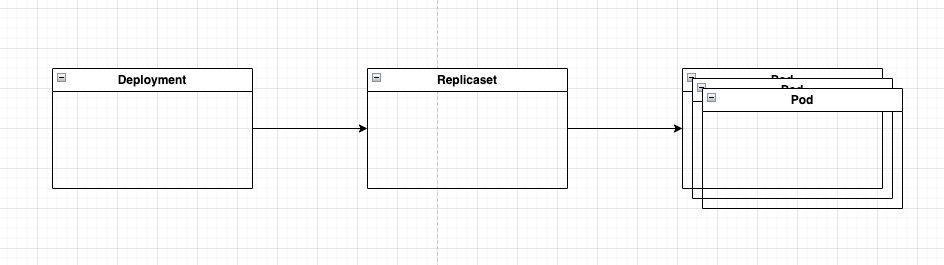
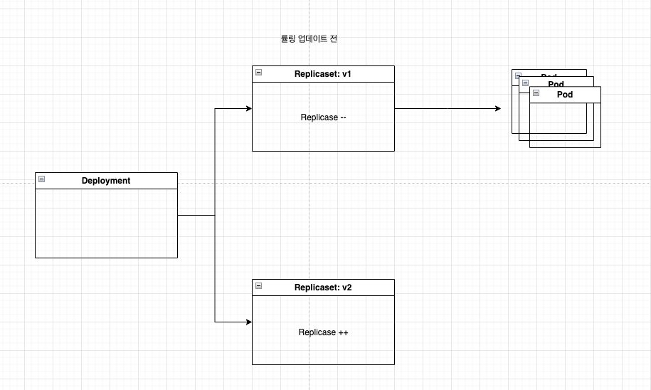
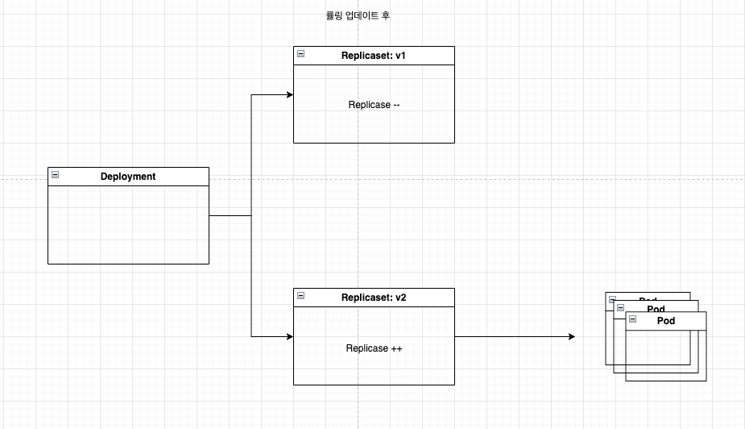

## Deployment
- 디플로이먼트는 낮은수준의 개념으로 레플리케이션컨트롤러 or 레플리카셋을 통해 수행하는 대신 애플리케이션을 배포하고 선언적으로 업데이트하기 위한 높은 수준의 리소스다.
- 디플로이먼트를 생성하면 레플리카셋 리소스가 그 아래에 생성이된다. 레플리카셋은 레플리케이션컨트롤러 이므로 레플리케이션컨트롤러 대신 레플리카셋을 사용해야 한다. 레플리카셋도 파드를 복제하고 관리한다. 
- 그러나 디플로이먼트를 사용하게된다면 실제 파드는 디플로이먼트가 아닌 디플로이먼트의 레플리카셋에 의해 생성되고 관리된다.

Deployment는 파드를 관리하지않는다. 대신 레플리카셋을 생성하고 이들이 파드를 관리한다.

## Deployment 업데이트 전략 
Recreate 전략: 레플리케이션컨트롤러의 파드 템플릿을 수정한 후 모든 파드를 삭제하는 것과 마찬가지로 한 번에 기존 모든 파드를 삭제한 뒤 새로운 파드를 만든다. 
Recreate를 사용하게된다면, 새 파드를 만들기 전에 이전 파드를 모두 삭제한다.
- 만약에 애플리케이션이 여러 버전을 병렬로 실행하는 것을 지원하지 않고 새 버전을 시작하기 전에 이전 버전을 완전히 중지해야 하는 경우만 이 전략을 사용하자. 이 전략은 잠시 다운타임이 생긴다.
- 만약에 이전 버전과 새 버전을 동시에 실행할 수 있는 경우는 RollingUpdate 전략을 사용하자. 

디플로이먼트의 파드 템플릿이 Configmap or Secret을 참조하는 경우에는 아무리 configmap을 수정해도 업데이트를 시작하지않는다. 애플리케이션의 설정을 수정해야할 때 업데이트를 시작하는 한 가지 방법은 새 컨피그맵을 만들고 파드 템플릿이 새 컨피그맵을 참조하도록 하는 것이다. 

